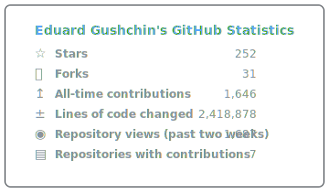

<h1 align="center">👋 Hi, I'm Eduard Gushchin</h1>

  <b>C# / .NET / SDL3 Developer Tooling</b> 
  🛠️ Native Interop • Runtime APIs • Automation • Agent-native Workflows

  
  
  

💻 I'm a C# developer focused on developer tooling, native interop, and runtime infrastructure. I build C# bindings, small runtime layers, and automation that make low-level APIs easier to use from .NET.

💡 I like turning complex systems into clear APIs, reliable workflows, and maintainable tools.

### Now

- Maintaining [SDL3-CS](https://github.com/edwardgushchin/SDL3-CS), a C# wrapper for SDL3.
- Building [Electron2D](https://github.com/edwardgushchin/Electron2D) as an agent-native C# runtime and tooling experiment.
- Exploring API design, native interop, build pipelines, and automation around .NET developer workflows.

### Favorite Tech

  

### Projects

| Project | What it is | Status |
| --- | --- | --- |
| [SDL3-CS](https://github.com/edwardgushchin/SDL3-CS) | C# wrapper for SDL3, focused on .NET, native interop, and cross-platform runtime APIs. |   |
| [Electron2D](https://github.com/edwardgushchin/Electron2D) | Agent-native C# runtime project focused on architecture, tooling, and clear developer workflows. |   |

### Engineering Notes

- I like APIs that make the fast path obvious and the unsafe path explicit.
- I prefer small runtime layers that can be tested, profiled, and replaced independently.
- I care about tooling because systems code is only useful when the workflow around it is reliable.

### Metrics

  

### Contact

  
  

