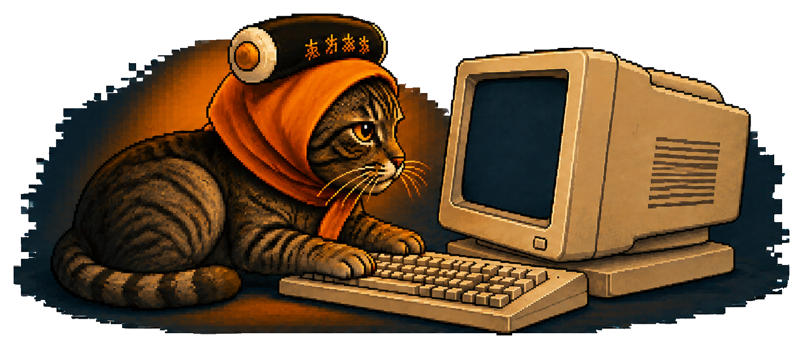

### Hi!

I'm Eduard, a C#/.NET developer working across game development, native interop, developer tools, Linux desktop integration, and networking.

I build libraries, tools, and integrated systems that make complex platforms easier to use.

You can reach me on [Telegram](https://t.me/eduardgushchin) or by [email](mailto:eduardgushchin@yandex.ru).

#### My projects

🌸 Game development

- [SDL3-CS](https://github.com/edwardgushchin/SDL3-CS) — Modern C# bindings and native NuGet packages for SDL3 and its companion libraries.
- [Electron2D](https://github.com/edwardgushchin/Electron2D) — An agent-native, cross-platform 2D game engine for .NET.

🌸 Developer tools

- [TaskPact](https://github.com/edwardgushchin/TaskPact) — An agent-native Kanban task board for software projects.
- [Codex Worklog](https://github.com/edwardgushchin/codex-worklog) — A local Codex plugin that automatically records what changed, when, and why in an append-only Markdown worklog.

🌸 Linux desktop

- [stillglass-desktop](https://github.com/edwardgushchin/stillglass-desktop) — A coherent GNOME desktop maintained as focused downstream layers over current upstream components.

🌸 OpenWrt

- [luci-app-zapret2](https://github.com/edwardgushchin/luci-app-zapret2) — A minimal LuCI panel for `bol-van/zapret2` on OpenWrt and GL.iNet routers.
